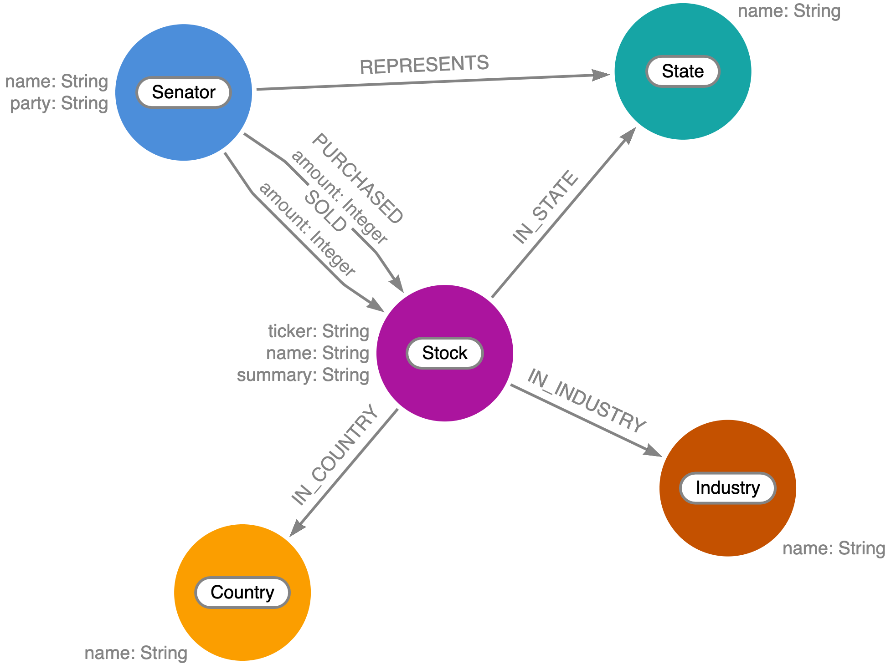

# senator-stock-graph

Analyzing US legislator financial transactions using Neo4j.



## Data ([`data/`](data/))

([`data/`](data/)) contains scripts for scraping and fetching data from multiple sources as well as the result data from running those scripts (data may change over time and this repo might not contain the latest version). Specifically:

* [US Senate Financial Disclosure Filings (eFD)](https://efdsearch.senate.gov/search/home/)
* Company data from Yahoo! Finance
* US Legislators


## Neo4j Browser Guide ([`guides/`](guides/))

[`guides/`](guides/) contains the source for a Neo4j Browser Guide that covers data import and querying using Cypher and Neo4j.

To load browser guide in Neo4j:

1. Provision [free Neo4j AuraDB instance](https://dev.neo4j.com/neo4j-aura) and open Neo4j Browser
2. Run the following command in Neo4j Browser:

```
:play senatestocks
```


## TODO

- [ ] Add legislative committees and membership
- [ ] Add bill sponsorship, bill subjects, and committee assignments
- [ ] Add misconduct reports
- [ ] Add 10k SEC filings (risks?)
- [ ] Add lobbyist filings
- [ ] Add FEC campaign finance
- [ ] Rename to something with stonks in the title

## Other Resources

* [*Graphs In Data Journalism: Hands On With Neo4j Graph Database*](https://dev.neo4j.com/wrangler-neo4j) - presented at Brown Institute / Colombia Journalism School, Nov 2021
